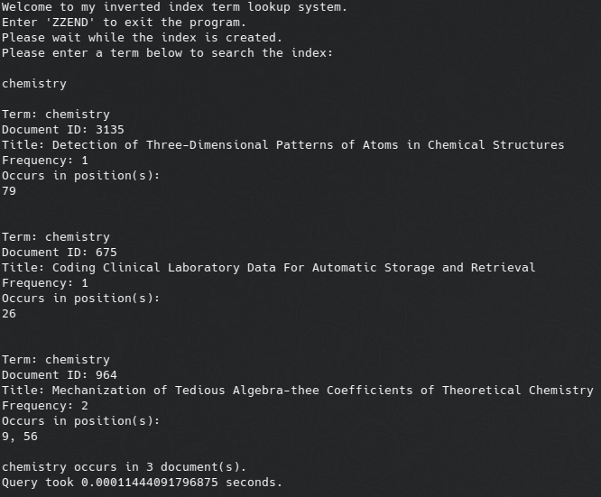

# inverted-index-search

inverted index document search app

## About

### Overview

This is an inverted index creation and lookup system written for the
Information Retrieval and Web Search class I took at Toronto Metropolitan
University. The objective is to parse a large file (cacm.all) containing number
of documents that are separated by different headers. These documents contain
a document ID, title, author list, abstract, and other information that is
parsed and indexed by the program to create a term lookup system. When a
term is searched, the document ID, document title, term location(s), and
the frequency of occurences within the document is reported, as well as
the amount of time that the search query took to complete.

The index system also has the option to use a porter stemming algorithm
to stem the words to increase search result matches, as well as an option
for the removal of common words so that it is more streamlined, and the
hashmaps encounter less possible collisions. The stemming algorithm was
not written by myself, and can be found [here](https://tartarus.org/martin/PorterStemmer/python.txt).

### Data Structures

The index lookup uses a combination of python dictionaries and lists
to create an index lookup system with a theoretical best case time
complexity of O(1).

- An inverted index object stores a dictionary where each term is a key that
is associated with a list of document id's containing the term as the value.

- The index object also stores a list of document objects stored in ascending
order of document ID, so that finding a document object is a simple list index
operation with a time complexity of O(1).

- Each document object contains a dictionary where each term is a key that
is associated with a list of positions within the document where the term
has occurred, so that the positions can be accessed with a time complexity
of O(1).

- The length of this list of term positions is also the frequency of term
occurences within the document.

## Usage

1. Clone the repository: `https://github.com/cw417/inverted-index-search.git`

2. The application takes two command line arguments to turn the stemming and
common word removal algorithms on or off. These arguments are made in the form
of 0/1 for off/on. Example commands are given below:
    - Common word removal off, stemming off:
    `python3 app.py 0 0`
    - Common word removal off, stemming on:
    `python3 app.py 0 1`
    - Common word removal on, stemming off:
    `python3 app.py 1 0`
    - Common word removal on, stemming on:
    `python3 app.py 1 1`

- An example of a search for the term `chemistry` when the program is run with
common word removal and stop word removal turn off, `python3 app.py 0 0`:
    